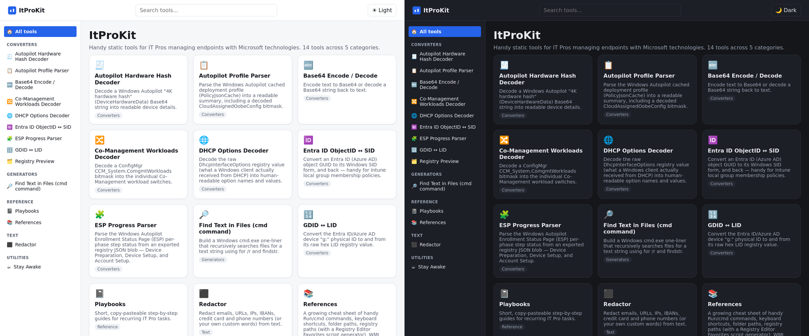

# ItProKit (IPK)

**Fast, static, client-side tools for IT Pros managing Microsoft-managed endpoints — Intune, Autopilot, Entra ID, ConfigMgr, and Windows. No installs, no backend, nothing ever leaves your browser.**



## Why

Think [IT Tools](https://it-tools.tech/), but focused on day-to-day endpoint
management tasks: decoding hardware hashes, parsing ESP/Autopilot JSON blobs,
converting Entra ID GUIDs to SIDs, browsing exported `.reg` files, and more.

- ⚡ **Fast** — plain Vite + Vanilla TypeScript, no framework overhead.
- 🔒 **Private by design** — everything runs in your browser; tools never
  upload pasted data anywhere.
- 🌗 **Dark & light mode** — follows your system theme or toggle manually.
- 🧩 **Trivially extensible** — adding a tool means "drop a folder", nothing
  else to wire up.
- 🐳 **Run anywhere** — use the hosted static build, run it in Docker/WSL, or
  just `npm run dev` locally.

## Usage

Open the app and either browse the sidebar/categories or use the search box
at the top to find a tool by name or keyword. Each tool is self-contained —
paste/enter your input, get the decoded/converted/generated output, and use
the copy buttons to grab results. Nothing you type is sent anywhere; most
tools persist your last input in `sessionStorage` only (cleared when you
close the tab).

## Tools

- Autopilot Hardware Hash Decoder
- Autopilot Profile Parser
- Base64 Encode / Decode
- Co-Management Workloads Decoder
- DHCP Options Decoder
- Entra ID ObjectID ↔ SID
- ESP Progress Parser
- GDID ↔ LID
- Registry Preview
- Find Text in Files (cmd command)
- Playbooks
- References
- Redactor
- Stay Awake

New tools land often — check the in-app sidebar for the current list.

## Running it

### Docker (recommended for self-hosting)

A tiny nginx-based image is published to GitHub Container Registry on every
release:

```bash
docker run -d --name ipk -p 8080:80 ghcr.io/mrwyss-msft/ipk:latest
```

Then open `http://localhost:8080`. Works on Linux, Windows (Docker Desktop /
WSL2), and Apple Silicon — images are published for both `linux/amd64` and
`linux/arm64`.

On Windows you don't even need Docker Desktop: with an up-to-date WSL
(`wsl --update`) you can run the same image with the built-in `wslc` CLI
instead:

```powershell
wslc run -d --name ipk -p 8080:80 ghcr.io/mrwyss-msft/ipk:latest
```

### Local development

Easiest: open the repo in the included **dev container**
(VS Code "Reopen in Container" or GitHub Codespaces) — it's preconfigured
with Node.js and runs `npm install` for you automatically.

No dev container? Requirements: **Node.js 20+** (22 recommended).

```bash
npm install
npm run dev        # starts Vite dev server with HMR
```

```bash
npm run build       # tsc --noEmit && vite build -> dist/
npm run preview      # serve the production build locally
npm run typecheck    # tsc --noEmit only
```

## Contributing

### For humans

1. Fork/branch, make your change, and verify with `npm run build` (must be
   type-clean) before opening a PR.
2. Commit messages must follow [Conventional Commits](https://www.conventionalcommits.org/)
   (`feat:`, `fix:`, `perf:`, `revert:`, `docs:`, `chore:`, …) — they drive
   the auto-generated `CHANGELOG.md` sections (✨ Features, 🐛 Bug Fixes, …).
3. Adding a new tool is just dropping a new `src/tools/<kebab-id>/` folder —
   it's auto-discovered, no registry/router edits needed. See
   [AGENTS.md](AGENTS.md) for the exact folder contract, styling
   conventions, and established patterns (PowerShell "run here, paste
   there" tools, bitmask/`[Flags]` decoding, theming tokens, etc.).

### For AI agents

Read [AGENTS.md](AGENTS.md) first — it documents the architecture, the tool
contract, CSS/theming conventions, the "no network calls" hard requirement,
and testing/verification steps (`npm run build`, throwaway `.ts` scripts via
`npx tsx` for pure logic). Follow its conventions exactly; it's kept in sync
with how this repo actually works.

## Releases

Maintainers cut a release with `npm run release` ([release-it](https://github.com/release-it/release-it)
+ Conventional Commits), which bumps the version, regenerates
`CHANGELOG.md`, and pushes a `vX.Y.Z` tag. Publishing the GitHub Release
from that tag triggers [`docker-release.yml`](.github/workflows/docker-release.yml),
which builds and pushes the multi-arch image to GHCR.
